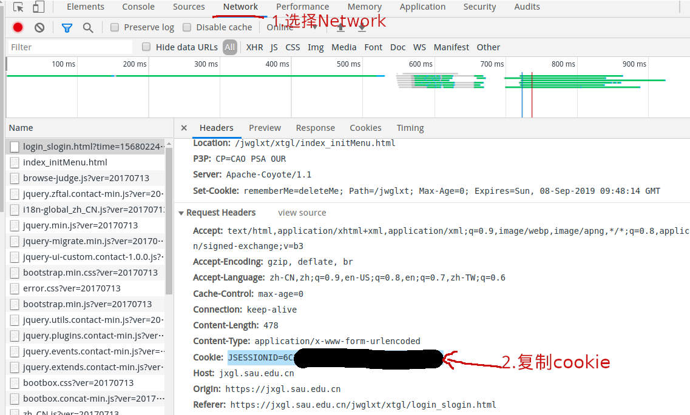
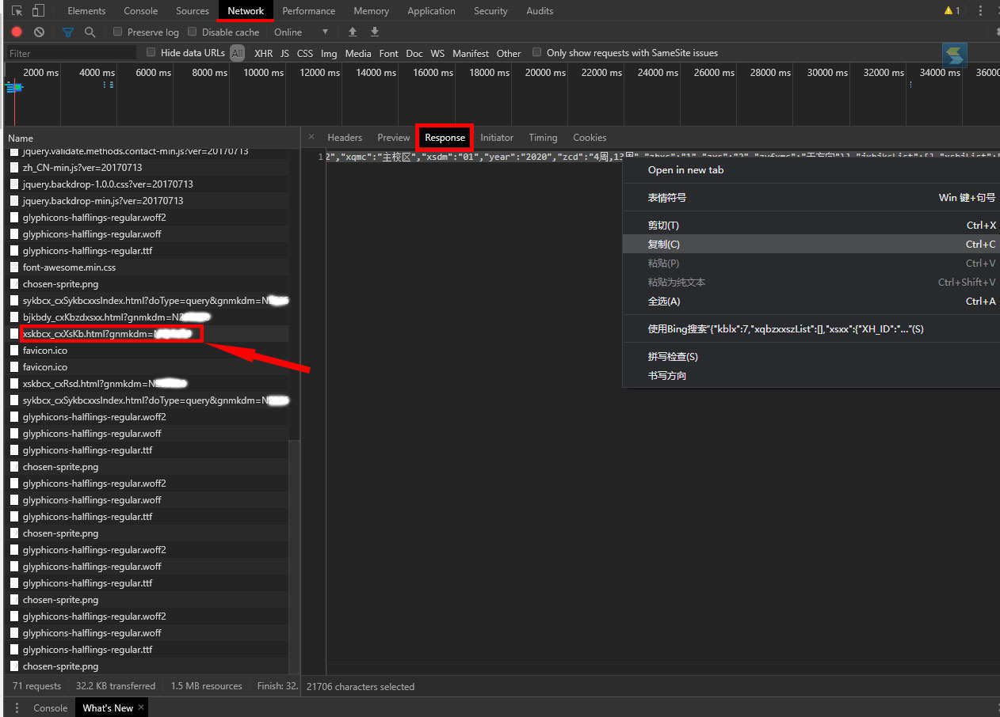
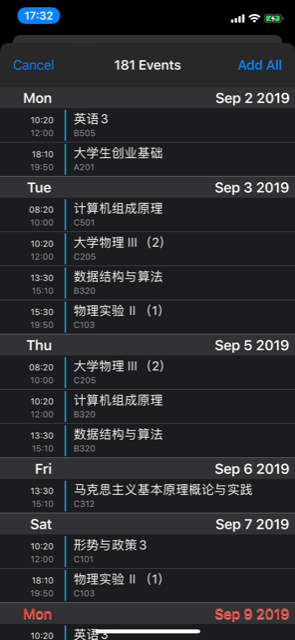
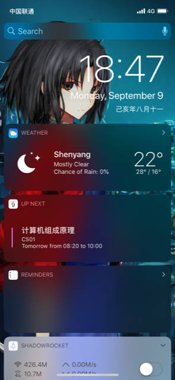

# SAU Class Schedule To iCalendar

访问[新教务管理系统](https://jxgl.sau.edu.cn/jwglxt)，将沈航课程表转换成[iCanedar](https://tools.ietf.org/html/rfc2445)文件，可将课程信息导入手机日历中，~~然后把微信里那烦人并且不好用的智慧沈航提醒给关掉~~。


# Usage

```
git clone https://github.com/STARRY-S/SAUClassScheduleToiCalender.git
cd SAUClassScheduleToiCalendar
pip install -r requirements.txt
python sau_class_schedule_to_ics.py -h
```
> 因 ~~教务系统换新~~ 我太菜了(懒)，不能帐号密码登录获取课表信息，只能手动在浏览器登录再通过cookie运行程序。（毕竟能用就行）

----

## 连接到校园网的情况：

1. Chrome浏览器打开教务管理系统，按F12，打开Network，输入用户名和密码登录。

2. 找到Request Headers，复制Cookies，通过指令`$ python sau_class_schedule_to_ics.py -c JSESSIONID=XXXXX`运行。


## 没有连接到校园网的情况:

1. Chrome打开教务管理系统，按F12，打开Network，输入用户密码登录后打开选课->学生课表查询。

2. 选择`xskbcx_cxXsKb.html`字样开头的文件，将Response的那一大坨文字全选复制，新建个文本文件复制过去。


3. `$ python sau_class_schedule_to_ics.py -f filename.txt`

# Screenshot



----



iPhone设备可通过手机自带邮箱软件，通过将ics文件发送至邮箱，将ics文件中的日程添加到日历中。

# Others

欢迎提issue。

参考[JMUClassScheduleToiCalender](https://github.com/LGiki/JMUClassScheduleToiCalender)。
