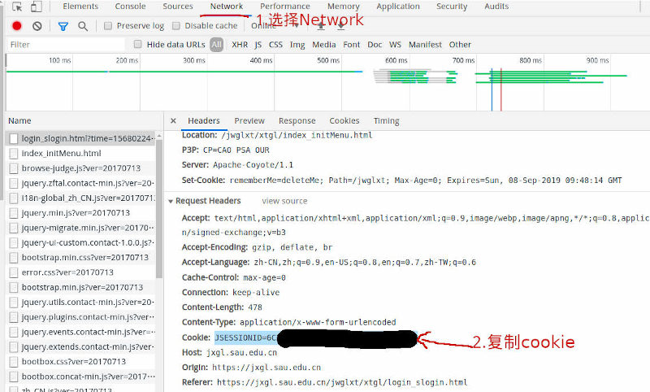

# SAU Class Schedule To iCalendar
将沈航课程表转换成[iCanedar](https://tools.ietf.org/html/rfc2445)文件，可将课程信息导入手机日历中，

# Usage
'''
git clone https://github.com/STARRY-S/SAUClassScheduleToiCalendar.git
cd SAUClassScheduleToiCalendar
pip3 install -r requirements.txt
python sau_class_schedule_to_ics.py
``` 
> 因教务系统换新，暂不能实现通过学号和密码来获取课表信息，只能通过cookie获取数据。
1. Chrome浏览器打开新版教务管理系统，按F12键，打开Network，输入用户名和密码登录
2. 复制Cookies到`sau_class_schedule_to_ics.py`中


# Screenshot

